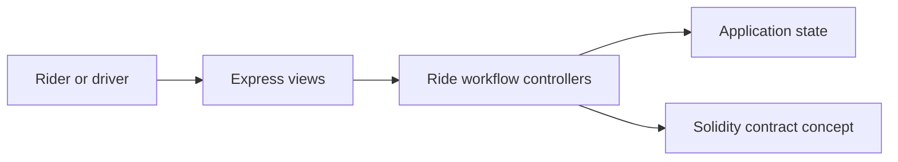
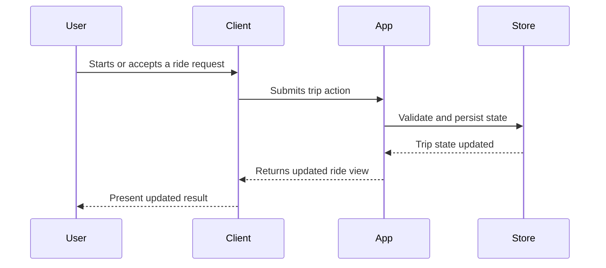

# Architecture

RideX uses a server-rendered Express application for ride workflows and keeps the contract concept separate from the application shell.

## Component View

## Key Components

- EJS views for rider and driver surfaces
- Express controllers for trip workflows
- Static demo assets
- Solidity contract artifact

## Main Workflow

## Design Considerations

- Separate rider and driver responsibilities clearly
- Model trip state as a lifecycle
- Treat location, pricing, and safety as first-class future concerns

